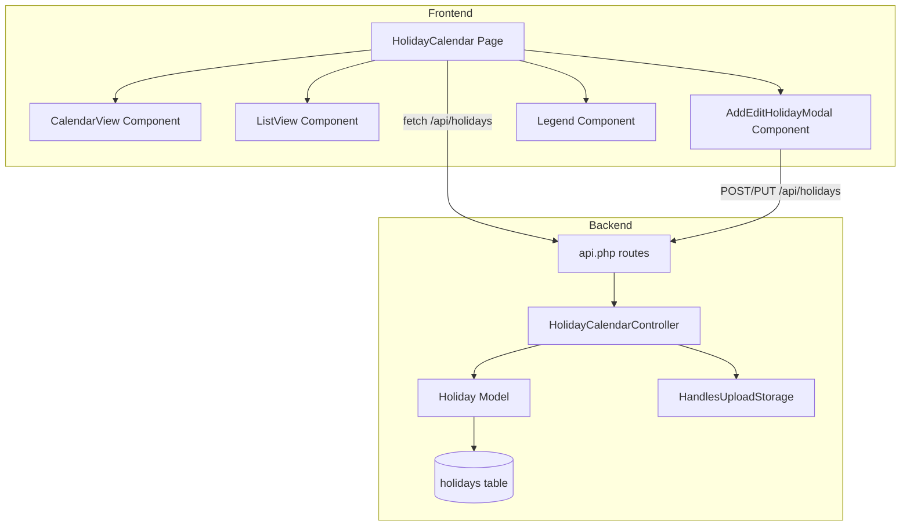

# Design Document: Holiday Calendar

## Overview

The Holiday Calendar feature adds a dedicated page for viewing and managing school holidays. All authenticated users can view holidays in a monthly calendar grid and a searchable list. Admins can create, edit, and delete holidays via a modal form. Holidays are classified into four types (National, Religious, School, Optional), each with a distinct color. Recurring holidays are projected forward to the requested year automatically by the API.

The feature follows the existing patterns in this codebase: a dedicated Laravel controller under `Api/`, raw `DB::table()` queries, `HandlesUploadStorage` for image uploads, `user_roles` table for RBAC, and a React/TypeScript frontend with fetch-based API calls.

---

## Architecture



The frontend page owns all state (holidays array, current month/year, search query, modal open/close). The backend is a single controller with five actions: index, store, update, destroy, and a dedicated image upload endpoint.

---

## Components and Interfaces

### Backend

**`HolidayCalendarController`** — `backend/app/Http/Controllers/Api/HolidayCalendarController.php`

| Method | Route | Description |
|--------|-------|-------------|
| `index` | `GET /api/holidays` | List holidays, optional `?year=` filter, projects recurring holidays |
| `store` | `POST /api/holidays` | Create holiday (admin only), handles optional image upload |
| `update` | `PUT /api/holidays/{id}` | Update holiday (admin only), handles optional image replacement |
| `destroy` | `DELETE /api/holidays/{id}` | Delete holiday and its image (admin only) |

The controller uses `HandlesUploadStorage` for image handling, matching the `GalleryController` pattern exactly.

RBAC is enforced via the same `isAdmin()` helper pattern used in `AdminTimetableController` and `GalleryController`:
```php
private function isAdmin(Request $request): bool
{
    return DB::table('user_roles')->where('user_id', $request->user()->id)->value('role') === 'admin';
}
```

**`Holiday` Model** — `backend/app/Models/Holiday.php`

Minimal Eloquent model with `$fillable` and `$casts`. No relationships needed.

### Frontend

**`HolidayCalendar` page** — top-level page component. Owns:
- `holidays: Holiday[]` state (fetched from API)
- `currentYear: number`, `currentMonth: number` state
- `searchQuery: string` state
- `modalState: { open: boolean; holiday: Holiday | null }` state
- Role check from auth context to conditionally render admin controls

**`CalendarView`** — receives `holidays`, `year`, `month`, navigation callbacks. Renders a 7-column CSS grid. Highlights days by mapping each holiday's date range to individual calendar cells, colored by type.

**`ListView`** — receives `holidays` (pre-filtered by search), renders a scrollable list with name, type badge, date range, and duration. Duration computed as `differenceInCalendarDays(endDate, startDate) + 1` (or 1 if no end date).

**`AddEditHolidayModal`** — controlled modal. Accepts `holiday | null` (null = create mode). Fields: name, start date, end date, type select, description textarea, image file input, recurring toggle. Submits via `FormData` for image support.

**`Legend`** — static component rendering the four type→color mappings.

### Type Color Map

```typescript
export const HOLIDAY_TYPE_COLORS: Record<string, string> = {
  national:  '#EF4444', // red-500
  religious: '#8B5CF6', // violet-500
  school:    '#3B82F6', // blue-500
  optional:  '#F59E0B', // amber-500
};
```

---

## Data Models

### `holidays` table migration

```php
Schema::create('holidays', function (Blueprint $table): void {
    $table->id();
    $table->string('name', 255);
    $table->enum('type', ['national', 'religious', 'school', 'optional']);
    $table->date('start_date');
    $table->date('end_date')->nullable();
    $table->text('description')->nullable();
    $table->string('image_url', 2048)->nullable();
    $table->boolean('is_recurring')->default(false);
    $table->unsignedBigInteger('created_by')->nullable();
    $table->timestamps();

    $table->index(['start_date', 'end_date']);
    $table->index('is_recurring');
});
```

### API Response Shape (Requirement 9.1)

```json
{
  "id": 1,
  "name": "Independence Day",
  "type": "national",
  "start_date": "2025-08-15",
  "end_date": null,
  "description": null,
  "image_url": null,
  "is_recurring": true,
  "created_at": "2025-01-10T09:00:00.000000Z"
}
```

### Recurring Holiday Projection Logic

When `?year=Y` is requested, the API:
1. Fetches all non-recurring holidays whose date range overlaps year Y.
2. Fetches all recurring holidays from any year, then projects each to year Y by replacing the year component of `start_date` (and `end_date` if present) with Y.
3. Merges and returns the combined list sorted by `start_date`.

If no `year` is provided, the current calendar year is used as the default.

```php
// Pseudocode for projection
$recurring = DB::table('holidays')->where('is_recurring', true)->get();
$projected = $recurring->map(function ($h) use ($year) {
    $start = Carbon::parse($h->start_date)->setYear($year);
    $end   = $h->end_date ? Carbon::parse($h->end_date)->setYear($year) : null;
    return array_merge((array) $h, [
        'start_date' => $start->toDateString(),
        'end_date'   => $end?->toDateString(),
        'id'         => 'recurring_'.$h->id.'_'.$year, // virtual id for frontend key
    ]);
});
```

Virtual IDs for projected recurring holidays use the format `recurring_{id}_{year}` so the frontend can distinguish them from stored records. The frontend treats them as read-only display items (edit/delete actions resolve to the original record ID).

---

## Correctness Properties

*A property is a characteristic or behavior that should hold true across all valid executions of a system — essentially, a formal statement about what the system should do. Properties serve as the bridge between human-readable specifications and machine-verifiable correctness guarantees.*

### Property 1: Valid holiday creation round-trip

*For any* valid holiday payload (non-empty name, valid start date, type in the allowed enum), POSTing to the create endpoint and then fetching the list should return a holiday whose fields match the submitted values.

**Validates: Requirements 3.4, 9.1**

### Property 2: End-date-before-start-date is always rejected

*For any* holiday payload where `end_date` is strictly before `start_date`, both the create and update endpoints SHALL return HTTP 422.

**Validates: Requirements 3.7, 4.5**

### Property 3: Missing required fields are always rejected

*For any* create request missing `name` or `start_date`, the API SHALL return HTTP 422 with a validation error identifying the missing field.

**Validates: Requirements 3.5, 3.6**

### Property 4: Non-admin write operations are always forbidden

*For any* authenticated non-admin user (teacher or parent), calling the create, update, or delete endpoint SHALL return HTTP 403.

**Validates: Requirements 6.3, 6.4, 6.5**

### Property 5: Year filter returns only overlapping holidays

*For any* integer year Y, the list endpoint with `?year=Y` SHALL return only holidays whose date range overlaps the calendar year Y (i.e., `start_date <= YYYY-12-31` AND (`end_date >= YYYY-01-01` OR `end_date IS NULL AND start_date >= YYYY-01-01`)).

**Validates: Requirements 9.3**

### Property 6: Recurring holiday projection preserves metadata

*For any* recurring holiday H stored in year Y₀, requesting the list for year Y₁ (Y₁ ≠ Y₀) SHALL include a projected entry with the same `name`, `type`, and `description` as H, with `start_date` year component equal to Y₁.

**Validates: Requirements 7.2, 7.3**

### Property 7: Duration is always ≥ 1

*For any* holiday in the list view, the computed Duration (inclusive day count) SHALL be at least 1. A holiday with no `end_date` has Duration = 1; a holiday where `end_date = start_date` also has Duration = 1.

**Validates: Requirements 8.3, 9.2**

### Property 8: Search filter is case-insensitive and subset-correct

*For any* search string S and holiday list L, the filtered result SHALL contain exactly those holidays in L whose `name` contains S as a case-insensitive substring, and no others.

**Validates: Requirements 1.10, 8.2**

### Property 9: Invalid year parameter is rejected

*For any* `year` query parameter value that is not a valid four-digit integer (e.g., letters, three-digit numbers, floats), the list endpoint SHALL return HTTP 422.

**Validates: Requirements 9.4**

### Property 10: List is sorted by start date ascending

*For any* set of holidays returned by the list endpoint, the `start_date` values SHALL be in non-decreasing order.

**Validates: Requirements 8.1**

### Property 11: Any authenticated user can read the holiday list

*For any* authenticated user regardless of role (admin, teacher, or parent), calling `GET /api/holidays` SHALL return HTTP 200.

**Validates: Requirements 6.6**

---

## Error Handling

| Scenario | HTTP Status | Response |
|----------|-------------|----------|
| Missing `name` or `start_date` | 422 | `{ "errors": { "name": [...] } }` (Laravel validation format) |
| `end_date` before `start_date` | 422 | `{ "errors": { "end_date": ["End date must be on or after start date."] } }` |
| Invalid `year` query param | 422 | `{ "errors": { "year": ["The year must be a 4-digit integer."] } }` |
| Non-admin write attempt | 403 | `{ "message": "Forbidden" }` |
| Holiday not found on update/delete | 404 | `{ "message": "Not found" }` |
| Image upload failure | 422 | `{ "message": "Image upload failed. Check storage permissions." }` |
| Unauthenticated request | 401 | `{ "message": "Unauthenticated." }` (from `ApiTokenAuth` middleware) |

Image upload errors follow the same pattern as `GalleryController::uploadImage()` — catch `\Throwable`, log with context, return 422.

---

## Testing Strategy

### Unit / Integration Tests

Focus on specific examples and edge cases:

- `GET /api/holidays` returns 200 for any authenticated user
- `POST /api/holidays` with valid data returns 201 and correct fields
- `POST /api/holidays` with missing name returns 422
- `POST /api/holidays` with `end_date < start_date` returns 422
- `PUT /api/holidays/{id}` by non-admin returns 403
- `DELETE /api/holidays/{id}` removes the record and its image
- Recurring holiday appears in projected year with correct date
- `?year=abc` returns 422

### Property-Based Tests

Use **fast-check** (TypeScript/frontend) for frontend logic and **PHPUnit with a simple generator helper** for backend validation rules. Minimum 100 iterations per property test.

Each property test is tagged with a comment in the format:
`// Feature: holiday-calendar, Property {N}: {property_text}`

| Property | Test Type | Library | Description |
|----------|-----------|---------|-------------|
| P1: Creation round-trip | Property | PHPUnit + generator | Random valid payloads → create → fetch → assert fields match |
| P2: End-before-start rejected | Property | PHPUnit + generator | Random dates where end < start → assert 422 |
| P3: Missing required fields | Property | PHPUnit + generator | Payloads with name or start_date omitted → assert 422 |
| P4: Non-admin forbidden | Property | PHPUnit + generator | Random non-admin roles → write endpoints → assert 403 |
| P5: Year filter overlap | Property | PHPUnit + generator | Random year + holidays → assert only overlapping returned |
| P6: Recurring projection | Property | PHPUnit + generator | Random recurring holiday + target year → assert projected metadata |
| P7: Duration ≥ 1 | Property | fast-check | Random date pairs → computeDuration → assert ≥ 1 |
| P8: Search filter correctness | Property | fast-check | Random holiday names + search strings → assert subset correctness |
| P9: Invalid year rejected | Property | PHPUnit + generator | Non-integer year values → assert 422 |
| P10: List sorted by start_date | Property | PHPUnit + generator | Random holiday sets → assert response start_dates are non-decreasing |
| P11: Authenticated list access | Property | PHPUnit + generator | Any authenticated role → GET /api/holidays → assert 200 |

**Property test configuration:**
- Each property test runs a minimum of 100 iterations
- Backend property tests use a `generateHoliday()` helper that produces random valid/invalid payloads
- Frontend property tests use `fc.string()`, `fc.date()`, and `fc.constantFrom()` arbitraries from fast-check
- Each test file includes a comment block referencing the design property number and text
